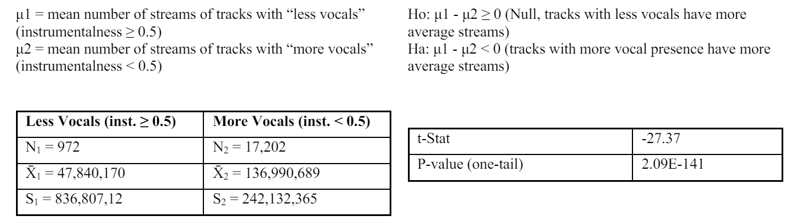

# 📌 Project Background  
In the age of digitalization, music streaming services have become a fundamental part of how listeners experience and engage with music. In 2023, Spotify had a global market share of 31.7% with over 350 million users worldwide. In this project, we tried to answer the question, "Can music be simplified to a formula? Specifically, are there certain musical elements, like song duration, significant factors in determining a track's overall success?". To answer this question, we looked at the Spotify [dataset](https://www.kaggle.com/datasets/sanjanchaudhari/spotify-dataset) posted on Kaggle.  

<i>In collaboration with Yilu Chen, Andrew Gatchalian, Hsuan-Yi Lin, and Rakesh Venkata Subramaniyan.</i>  

# 🎵 Data Overview  
The dataset that was used for this project contained over 18,000 tracks from Spotify. The data provided insight into artists, tracks, albums, streams received, and audio features. For each track, there are various audio feature attributes. For this project, we focused on the danceability, duration_min, energy, tempo, loudness, instrumentalness, and valance attributes.  

According to Spotify's developer documentation...    
- Danceability describes how suitable a track is for dancing based on a combination of musical elements including tempo, rhythm stability, beat strength, and overall regularity. This is a value between 0 and 1, where 0 is the least danceable and 1 is the most danceable.
- Duration_min is the duration of the track in milliseconds. This is an integer value that is greater than 0.
- Energy represents a perceptual measure of intensity and activity. Perceptual features contributing to this attribute include dynamic range, perceived loudness, timbre, onset rate, and general entropy. This is a value between 0 and 1, where 0 is the lowest energy and 1 is the most energy.
- Tempo is the overall estimated tempo of a track in beats per minute (BPM). This is a value that is typically greater than 60, where the lower the value the "slower" the track.  
- Loudness is the overall loudness of a track in decibels (dB). This value typically ranges between -60 and 0, where -60 dB is the lowest loudness and 0 dB is the highest loudness. In this dataset, the value is averaged across the entire track to provide a single value.
- Instrumentalness predicts whether a track contains vocals or no vocals. In this context, "ooh" and "aah" sounds are not treated as vocals, whereas rap or spoken words are considered vocals. This is a value between 0 and 1, where 0 represents tracks with the greatest amounts of vocal content and 1 represents highly instrumental tracks.
- Valance describes that musical positiveness is conveyed by a track. This is a value between 0 and 1, where 0 is the most "positive" and 1 is the most "negative".         

# 📈 Analysis  
### Descriptive Analysis  
For this project, we have decided that popularity would be defined as the number of streams a track has (the more streams = the more popular the track). Therefore, our dependent variable of interest is the number of streams. As such, we began our analysis by examining the distribution of streams. As shown in the histogram below, there were only a few "popular" tracks, with The Weeknd's "Blinding Lights" being the most popular with over 3 billion streams. Most observations seemed to lie within the 0-500 million range.   
    
      
      

### Statistical Analysis - Hypothesis Testing  
To test if the audio features we selected are relevant, we divided the observations with their respective streams into separate thresholds and then conducted hypothesis tests to determine whether each musical element is dependent or independent of the number of streams it receives. For example, for danceability, we formed the following hypotheses:  
    
      
      
The results showed a test statistic of 190.565 and a p-value of 9.198 x 10-8, indicating a relationship between danceability and the number of streams. Since the p-value is small, we rejected the null hypothesis and concluded that danceability and streams are not independent at a high level of significance. Following the same tests, we found that loudness and energy are also significant factors.    

As for instrumentalness feature, we wanted to see if we could determine whether tracks with more vocals or less vocals had more streams on average, using the following hypothesis test:  
    
      
      
According to the results, we rejected the null hypothesis, indicating that tracks with more vocal presence tended to have more streams than those with fewer vocals at a high level of significance.  

From the hypothesis tests for each musical element (danceability, energy, tempo, loudness, etc.), we concluded that tempo and duration are factors that do not seem to play a role in track popularity.  

### Statistical Analysis - Regression Model  
Though several of the musical elements passed hypothesis testing, we used regression modeling to see how strong their relationship is to the number of streams.  
    
      
      
From these results, it appears that danceability and loudness have a positive relationship with the number of streams, suggesting that the more danceable or loud a track is, the more popular it becomes. On the other hand, instrumentalness, energy, and valence show a negative relationship with streams. However, by examining the R squared, we found that the model is not statistically significant.  
    
      
      
The R squared of .022 means that this model only explains around 2% of why a track receives streams. In other words, there are other much more significant factors that influence a track's popularity aside from its musical elements.  
